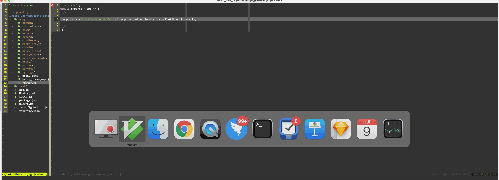

# README

Vim goto file for [eggjs](https://github.com/eggjs), support router, controllers, service, proxy, enums.



## INSTALL

By vim-plug:

```viml
Plug 'hotoo/jsgf.vim', { 'for': ['javascript', 'javascriptreat', 'typescript', 'typescriptreact', 'json'] }
Plug 'hotoo/eggjs-gf.vim', { 'for': ['javascript', 'typescript'] }
```

By [Vundle](https://github.com/VundleVim/Vundle.vim)

```viml
Plugin 'hotoo/jsgf.vim'
Plugin 'hotoo/eggjs-gf.vim'
```

This plugin is better work in with [jsgf.vim](https://github.com/hotoo/jsgf.vim) .

## USAGE

`gf` to open the define file which eggjs controller, service, proxy, enums path under the cursor.

### Options

Maybe you need `g:eggjs_gf_loadpath` option in .vimrc

```viml
" https://eggjs.org/zh-cn/advanced/loader.html#loadtocontext
let g:eggjs_gf_loadpath = 'service\|proxy\|model\|someVar'
```

## LICENSE

[The MIT License (MIT)](https://hotoo.mit-license.org/)
